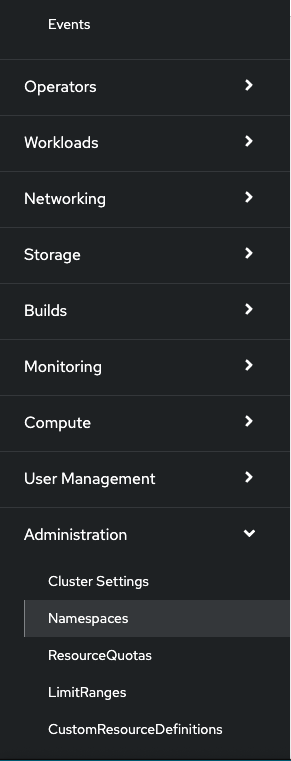
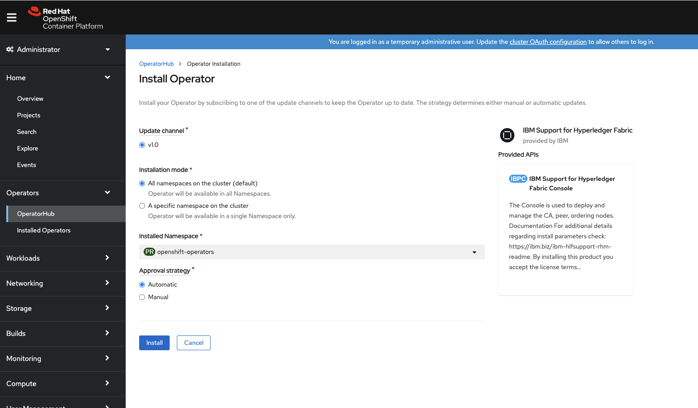
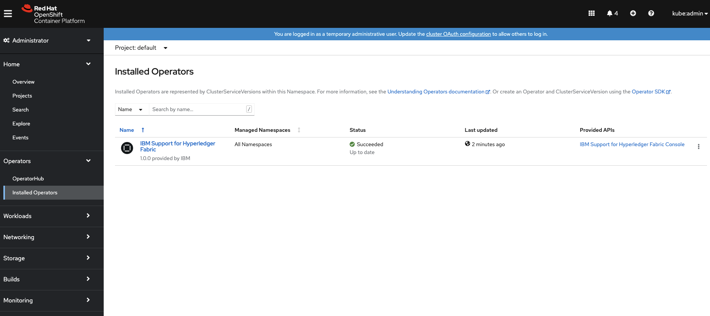
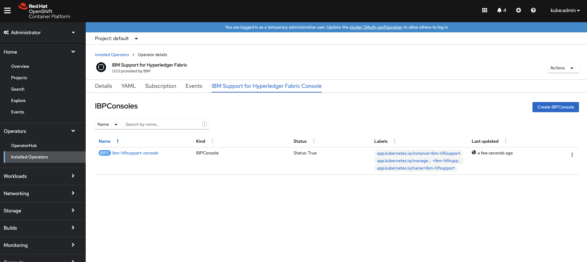
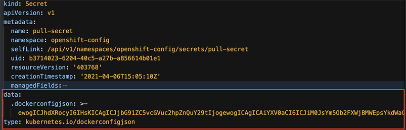
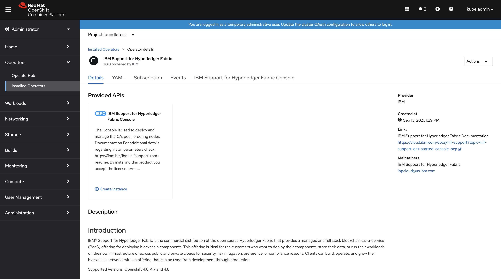
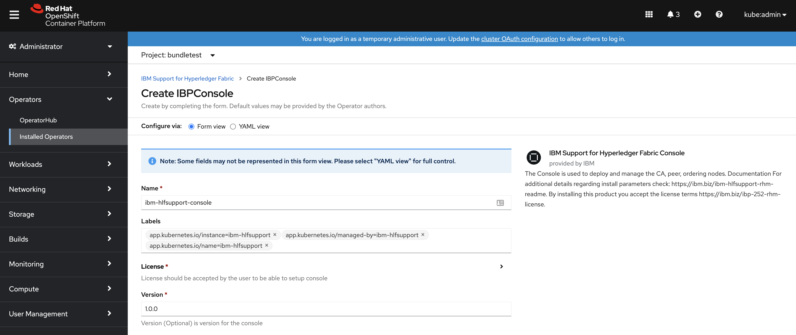

---

copyright:
  years: 2022
lastupdated: "2022-03-25"

keywords: OpenShift, Fabric Operations Console, deploy, resource requirements, storage, parameters, Red Hat Marketplace, subscription, operators

subcollection: hlf-support

---

{{site.data.keyword.attribute-definition-list}}


# Deploy from Red Hat Marketplace
{: #deploy-ocp-rhm}

The Red Hat Marketplace can be used to deploy the {{site.data.keyword.IBM_notm}} Support for Hyperledger Fabric operator onto a Kubernetes cluster on OpenShift Container Platform 4.6+. This operator deploys instances of the certificate authority (CA), peer, ordering nodes and the Fabric Operations Console that uses to manage the blockchain components on your network. This deployment option is available for OpenShift clusters that are running in {{site.data.keyword.cloud_notm}} or your cloud.
{: shortdesc}

## What is the Red Hat Marketplace?
{: #deploy-ocp-rhm-whatis}

The Red Hat Marketplace is available directly from your OpenShift web console. It provides an open cloud catalog that makes it easier to discover and access certified software for container-based environments in public clouds. With automated deployment, software is immediately available to deploy on any Red Hat OpenShift cluster, providing a fast, integrated experience. Discover and buy certified software, and quickly deploy. Access open source and proprietary software, with responsive support, streamlined billing and contracting, simplified governance, and single-dashboard visibility across clouds. Built in partnership by Red Hat and {{site.data.keyword.IBM_notm}}, this marketplace helps organizations deliver enterprise software and improve workload portability.

The marketplace provides a simplified alternative method for deploying an instance of the {{site.data.keyword.IBM_notm}} Support for Hyperledger Fabric to your cluster instead of the [manual deployment steps](/docs/hlf-support?topic=hlf-support-deploy-ocp) or by using [Ansible playbook](/docs/hlf-support?topic=hlf-support-ansible) scripts.

With just a few simple steps, you can get started with the {{site.data.keyword.IBM_notm}} Support for Hyperledger Fabric. After you install the operator to your OpenShift project, you can create a subscription that allows you to deploy the blockchain console UI.

Currently, you cannot deploy certificate authorities (CAs), peers, and ordering nodes directly, then, use the console to deploy those nodes instead. This tutorial includes only instructions for installing the console.
{: important}

To learn more about the Marketplace see the [Red Hat documentation](https://marketplace.redhat.com){: external}.

## Limitations
{: #deploy-ocp-rhm-limitations}

- This deployment option is not available on OpenShift Container Platform on LinuxONE.

- IBM Support for Hyperledger Fabric is supported on Red Hat OpenShift 4.6+.
- You are responsible for the management of health monitoring, logging, and resource usage of your blockchain components.
- IBM Support for Hyperledger Fabric is not supported on OpenShift Online.
- Mutual TLS is not supported between your applications and your blockchain nodes.
- You cannot use the extended support release(EMC Symmetrix for R) version of Firefox to log in to the Fabric Operations Console.

## Before you begin
{: #deploy-ocp-rhm-prerequisites}

You must have the cluster administrator role to install the operators from the Red Hat Marketplace.
{: note}

1. These instructions assume you already have a Kubernetes cluster available in OpenShift Container Platform v4.6+ and that you created a project for your {{site.data.keyword.IBM_notm}} Support for Hyperledger Fabric deployment. Unsure how to create a project? See [Create a project for your {{site.data.keyword.IBM_notm}} Support for Hyperledger Fabric deployment](#deploy-ocp-rhm-project).
2. Browse to the [Red Hat Marketplace](https://marketplace.redhat.com/en-us){: external} and log in or create a new account.
3. Follow the [instructions](https://marketplace.redhat.com/en-us/documentation/clusters#register-openshift-cluster-with-red-hat-marketplace) to register your OpenShift cluster with the Red Hat Marketplace.
4. When prompted `Would you like to go back to the Red Hat Marketplace now? [Y/n]`, type `Y` to retrieve the <wintitle>Red Hat Marketplace</wintitle> page in your browser.

## Step one: Create a namespace
{: #deploy-ocp-rhm-can}

From your OpenShift console, select **Administration** >> **Namespaces** from the left navigation:

{: caption="Figure 1. Administration namespaces menu selection" caption-side="bottom"}

On the **Namespaces** page, click  **Create Namespace** on the top right. Create a namespace for the deployment of operator and other blockchain components:

{: caption="Figure 2. Create namespace interface" caption-side="bottom"}

## Step two: Apply the Security Context Constraint (SCC)
{: #deploy-ocp-rhm-scc}

If you want to use the **All namespace on the cluster** option while installing the operator, this step of applying the SCC must also be applied to the **openshift-operators** namespace.
{: note}

{{site.data.keyword.IBM_notm}} Support for Hyperledger Fabric requires specific security and access policies to be added to your project. The `ibm-hlfsupport-scc.yaml` file is provided here for you to copy and edit to define the security policies for your project. Before attempting this step, you should be logged in to the `oc` CLI.   

Copy and save the following security context constraint object to your local system as `ibm-hlfsupport-scc.yaml`. Edit the file and replace `<PROJECT_NAME>` with the name of your project.

```yaml
allowHostDirVolumePlugin: false
allowHostIPC: false
allowHostNetwork: false
allowHostPID: false
allowHostPorts: false
allowPrivilegeEscalation: false
allowPrivilegedContainer: false
allowedCapabilities:
- NET_BIND_SERVICE
- CHOWN
- DAC_OVERRIDE
- SETGID
- SETUID
- FOWNER
apiVersion: security.openshift.io/v1
defaultAddCapabilities: []
fsGroup:
  type: RunAsAny
groups:
- system:serviceaccounts:<PROJECT_NAME>
kind: SecurityContextConstraints
metadata:
  name: <PROJECT_NAME>
readOnlyRootFilesystem: false
requiredDropCapabilities: []
runAsUser:
  type: RunAsAny
seLinuxContext:
  type: RunAsAny
supplementalGroups:
  type: RunAsAny
users:
- system:serviceaccounts:<PROJECT_NAME>
volumes:
- "*"
```
{: codeblock}

Run the following commands to add the file to your cluster and add the constraint to your project.

```
oc apply -f ibm-hlfsupport-scc.yaml -n <PROJECT_NAME>
oc adm policy add-scc-to-user <PROJECT_NAME> system:serviceaccounts:<PROJECT_NAME>
```
{: codeblock}

Replace `<PROJECT_NAME>` with the name that you want to use for your {{site.data.keyword.IBM_notm}} Support for Hyperledger Fabric deployment project.

When the command is successful, you see a response that is similar to the following example:
```
securitycontextconstraints.security.openshift.io/blockchain-project created
scc "blockchain-project" added to: ["system:serviceaccounts:blockchain-project"]
```
{: codeblock}

## Step three: Install the operator
{: #deploy-ocp-rhm-operator}

Install the {{site.data.keyword.IBM_notm}} Support for Hyperledger Fabric operator as follows:

1. Click **My software** > **Visit the Marketplace**.
2. In the search bar, type **blockchain** to load the blockchain tile. Select **{{site.data.keyword.IBM_notm}} Support for Hyperledger Fabric**.
3. Click **Purchase** to get started. From the **Purchase complete** page, click **Install now**. This installs the {{site.data.keyword.IBM_notm}} Support for Hyperledger Fabric operator into your cluster. Note that during the installation process you are required to select which OpenShift project to deploy the operator to from the **Namespace scope** drop-down. After the operator is installed, your cluster connects back to Red Hat Marketplace and then becomes a target cluster for installing and managing the operator from Red Hat Marketplace. You can deploy the operator multiple times across different clusters as long as they have registered with Red Hat Marketplace. When selecting a namespace for operator installation, **All namespaces on the cluster** is selected by default&mdash;**you must change this default selection to a specific namespace in the cluster** to make operator and Fabric components run in a dedicated namespace. {: caption="Figure 1. Install the operator in the openshift-operators namespace" caption-side="bottom"} The Console and Fabric components can be installed in any namespace. {: caption="Figure 2. Console and Fabric components can be installed in any namespace" caption-side="bottom"} Next, update the Security Context Constraint command settings to use the Fabric and Console namespaces. {: caption="Figure 3. Update Security Context Constraint command settings to use the Fabric and Console namespaces." caption-side="bottom"}
4. If your OpenShift cluster is behind a firewall, see [Deploy from Red Hat Marketplace (airgap installation)](/docs/hlf-support?topic=hlf-support-deploy-ocp-rhm-fw).

## Step four: Apply the image pull secrets
{: #deploy-ocp-rhm-secrets}

To apply the image pull secrets, go to the **OpenShift Container Platform**.

1. In the left navigation, click **Workloads** > **Secrets**.
2. In the search box next to the **Name** drop down, type **pull-secret**.
3. From the listing page, select **pull-secret**.
4. Click the **YAML** tab.
5. In the YAML tab, you see the YAML code as follows. Right-click to **copy only** the last two sets of codes. Those are the secret data and the secret data handling type.

    {: caption="Figure 4. Pull-secret YAML Sample" caption-side="bottom"}

6. After you copied the two sets of codes, go to the left navigation, click **Secrets**. Then, use the **Create** drop down from the upper right of the page to switch to **From YAML**.
7. Paste your two sets of codes under the existing YAML code.
8. Replace the existing YAML code by copying the following:
    ```
    kind: Secret
    apiVersion: v1
    metadata:
      name: regcred
      namespace: <Your IBM Support for Hyperledger Fabric namespace>
    ```
    {: codeblock}

9. Your complete set of pull-secret YAML code is now as follows:
    ```
    kind: Secret
    apiVersion: v1
    metadata:
      name: regcred
      namespace: <Your {{site.data.keyword.IBM_notm}} Support for Hyperledger Fabric namespace>
    data: <Your secret data here>
    type: kubernetes.io/dockerconfigjson
    ```
    {: codeblock}

10. Click **Create** to finish your setup.

## Step three: Deploy the Fabric Operations Console
{: #deploy-ocp-rhm-console}

There is one instance available listed under "Provided APIs":


{: caption="Figure 5. IBM Support for Hyperledger Fabric instance available in Red Hat Marketplace" caption-side="bottom"}

- **Fabric Operations Console** - The Fabric Operations Console UI, or "console", is an award-winning user interface for building your blockchain network.

All customers need to deploy an instance of the **Fabric Operations Console** to simplify the deployment and management of their blockchain networks. The console itself is free. You are only billed for the blockchain nodes that you create by using the console.

You should use the console to deploy Certificate Authorities (CAs), peers, and ordering nodes.
{: important}

Click **Create Instance** on the **Fabric Operations Console** tile.
{: caption="Figure 6. Click Create Instance on the Fabric Operations Console tile" caption-side="bottom"}

The YAML view shows a sample **console** specification of parameters that you need to customize. The spec is abbreviated to _only the required parameters_.  Be aware that some fields can show up differently based on your configuration. Before you install the console, you should also review the Advanced deployment options in the next section in case any of the other options are relevant to your configuration. For example, if you are deploying your console on a multizone cluster, you need to configure that before you install the console.
{: important}


```yaml
apiVersion: ibp.com/v1beta1
kind: IBPConsole
metadata:
  name: ibm-hlfsupport-console
  namespace: example
  labels:
    app.kubernetes.io/name: "ibm-hlfsupport"
    app.kubernetes.io/instance: "ibm-hlfsupport"
    app.kubernetes.io/managed-by: "ibm-hlfsupport"
spec:
  email: <EMAIL>
  password: <PASSWORD>
  imagePullSecrets:
  - regcred
  registryURL: cp.icr.io/cp
  license:
    accept: <ACCEPT>
  networkinfo:
    domain: <DOMAIN>
  storage:
    console:
      class: ''
      size: 5Gi
  serviceAccountName: ibm-hlfsupport
  version: 1.0.0
```
{: codeblock}

- Accept the {{site.data.keyword.IBM_notm}} Support for Hyperledger Fabric license by replacing `<ACCEPT>` with the text `true`.
- Replace `<EMAIL>` with the email address that you want to use for the console administrator.
- Replace `<PASSWORD>` with the password of your choice. This password becomes the default password for the console administrator but they are required to change it the first time they log in.
- Replace `<DOMAIN>` with the name of your cluster domain. You can find this value from your OpenShift web console URL. Examine the URL for the current page. It is similar to: `https://console-openshift-console.pa-0803-ocp43-0defdaa0c51bd4a2dcb024eab4bf04a1-0000.us-south.containers.appdomain.cloud/k8s/ns/pa0804/clusterserviceversions/ibm-blockchain.v1.0.0/ibp.com~v1beta1~IBPConsole/~new`. The value of the domain then would be `pa-0803-ocp43-0defdaa0c51bd4a2dcb024eab4bf04a1-0000.us-south.containers.appdomain.cloud`, after you remove `console-openshift-console` and `/k8s/ns/pa0804/clusterserviceversions/ibm-blockchain.v1.0.0/ibp.com~v1beta1~IBPConsole/~new`.  


You also need to make additional edits to the file depending on your choices in the deployment process. For example, if you created a new storage class for your network, provide the storage class that you created to the `class:` field.

If you are running OpenShift on Azure, you also need to change the storage class from `default` to `azure-standard`, unless you created your own storage class.
{: tip}


When you are satisfied with your edits to the specification, click **Create**.

The console can take a few minutes to deploy.
{: note}

After you create the console, you can verify that the console deployment is succeeded. See [Step four: Verify the console installation](#console-deploy-ocp-verify-install) for instructions on verifying and accessing the console.

### Advanced deployment options
{: #console-deploy-ocp-rhm-advanced}

Before you deploy the console, you can edit console specification to allocate more resources to your console or use zones for high availability in a multizone cluster. To take advantage of these deployment options, you can use the console resource definition with the `resources:` and `clusterdata:` sections added:

```yaml
apiVersion: ibp.com/v1beta1
kind: IBPConsole
metadata:
  name: ibm-hlfsupport-console
  namespace: your-project
  labels:
    app.kubernetes.io/name: "ibm-hlfsupport"
    app.kubernetes.io/instance: "ibm-hlfsupport"
    app.kubernetes.io/managed-by: "ibm-hlfsupport"
spec:
  email: <EMAIL>
  password: <PASSWORD>
  imagePullSecrets:
  - regcred
  registryURL: cp.icr.io/cp
  license:
    accept: <ACCEPT>
  networkinfo:
    domain: <DOMAIN>
  storage:
    console:
      class: default
      size: 5Gi
  serviceAccountName: ibm-hlfsupport
  version: 1.0.0
  clusterdata:
    zones:
  resources:
    console:
      requests:
        cpu: 500m
        memory: 1000Mi
      limits:
        cpu: 500m
        memory: 1000Mi
    configtxlator:
      limits:
        cpu: 25m
        memory: 50Mi
      requests:
        cpu: 25m
        memory: 50Mi
    couchdb:
      limits:
        cpu: 500m
        memory: 1000Mi
      requests:
        cpu: 500m
        memory: 1000Mi
    deployer:
      limits:
        cpu: 100m
        memory: 200Mi
      requests:
        cpu: 100m
        memory: 200Mi
```
{: codeblock}


- You can use the `resources:` section to allocate more resources to your console. The values in the example file are the default values allocated to each container. Allocating more resources to your console allows you to operate a larger number of nodes or channels.

- If you plan to use the console with a multizone Kubernetes cluster, you need to add the zones to the `clusterdata.zones:` section of the file. When zones are provided to the deployment, you can select the zone that a node is deployed to using the console or the APIs. As an example, if you are deploying to a cluster across the zones of dal10, dal12, and dal13, you would add the zones to the file by using the format below.
    ```yaml
    clusterdata:
      zones:
        - dal10
        - dal12
        - dal13
    ```
    {: codeblock}

When you finish editing the file, click **Create**.

Unlike the resource allocation, you cannot add zones to a running network. If you have already deployed a console and used it to create nodes on your cluster, you will lose your previous work. After the console restarts, you need to deploy new nodes.
{: important}

### Use your own TLS Certificates (Optional)
{: #console-deploy-ocp-use-your-own-tls-certificates-optional}

The Fabric Operations Console uses TLS certificates to secure the communication between the console and your blockchain nodes and between the console and your browser. You have the option of creating your own TLS certificates and providing them to the console by using a Kubernetes secret. If you skip this step, the console creates its own self-signed TLS certificates during deployment.

This step needs to be performed before the console is deployed.
{: important}

You can use a Certificate Authority or tool to create the TLS certificates for the console. The TLS certificate needs to include the hostname of the console and the proxy in the subject name or the alternative domain names. The console and proxy hostname are in the following format:

**Console hostname:** ``<PROJECT_NAME>-ibpconsole-console.<DOMAIN>``  
**Proxy hostname:** ``<PROJECT_NAME>-ibpconsole-proxy.<DOMAIN>``  

- Replace `<PROJECT_NAME>` with the name of your {{site.data.keyword.IBM_notm}} Support for Hyperledger Fabric deployment project.
- Replace `<DOMAIN>` with the name of your cluster domain. You can find this value from your OpenShift web console URL. Examine the URL for the current page. It is similar to: `https://console-openshift-console.pa-0803-ocp43-0defdaa0c51bd4a2dcb024eab4bf04a1-0000.us-south.containers.appdomain.cloud/k8s/ns/pa0804/clusterserviceversions/ibm-blockchain.v2.5.0/ibp.com~v1alpha2~IBPConsole/~new`. The value of the domain then would be `pa-0803-ocp43-0defdaa0c51bd4a2dcb024eab4bf04a1-0000.us-south.containers.appdomain.cloud`, after you remove `console-openshift-console` and `/k8s/ns/pa0804/clusterserviceversions/ibm-blockchain.v2.5.0/ibp.com~v1alpha2~IBPConsole/~new`.

Navigate to the TLS certificates that you plan to use on your local system. Name the TLS certificate `tlscert.pem` and the corresponding private key `tlskey.pem`. Run the following command to create the Kubernetes secret and add it to your OpenShift project. The TLS certificate and key need to be in PEM format.
```
kubectl create secret generic console-tls-secret --from-file=tls.crt=./tlscert.pem --from-file=tls.key=./tlskey.pem -n <PROJECT_NAME>
```
{: codeblock}

Replace `<PROJECT_NAME>` with the name of your {{site.data.keyword.IBM_notm}} Support for Hyperledger Fabric deployment project.

After you create the secret, add the `tlsSecretName` field to the `spec:` section with one indent added, at the same level as the `resources:` and `clusterdata:` sections of the advanced deployment options. You must provide the name of the TLS secret that you created to the field. The following example deploys a console with the TLS certificate and key that is stored in a secret named `"console-tls-secret"`:

```yaml
apiVersion: ibp.com/v1beta1
kind: IBPConsole
metadata:
  name: ibm-hlfsupport-console
  namespace: your-project
  labels:
    app.kubernetes.io/name: "ibm-hlfsupport"
    app.kubernetes.io/instance: "ibm-hlfsupport"
    app.kubernetes.io/managed-by: "ibm-hlfsupport"
spec:
  email: <EMAIL>
  password: <PASSWORD>
  imagePullSecrets:
  - regcred
  registryURL: cp.icr.io/cp
  license:
    accept: <ACCEPT>
  networkinfo:
    domain: <DOMAIN>
  storage:
    console:
      class: default
      size: 5Gi
  serviceAccountName: ibm-hlfsupport
  version: 1.0.0
  tlsSecretName: "console-tls-secret"
  clusterdata:
    zones:
      - dal10
      - dal12
      - dal13
```
{: codeblock}

## Step four: Verify the console installation
{: #console-deploy-ocp-verify-install}

You can confirm that the console is up by running the following command, replacing `<PROJECT_NAME>` with the name of your project:

```
kubectl get deployment -n <PROJECT_NAME>
```
{: codeblock}

If your console deployment is successful, you can see `ibm-hlfsupport-console` added to the deployment table, with a status of `4/4`. The console takes a few minutes to deploy. You might need to rerun the command and wait for the table to be updated.
```
NAME                           READY   STATUS    RESTARTS   AGE
ibm-hlfsupport-operator-f58cc8585-hvsw7   1/1     Running   0          15m
ibm-hlfsupport-console-6f69477796-sxzm9    4/4     Running   0          4m
```

The console consists of four containers that are deployed inside a single pod:
- `optools`: The console UI.
- `deployer`: A tool that allows your console to communicate with your deployments.
- `configtxlator`: A tool used by the console to read and create channel updates.
- `couchdb`: An instance of CouchDB that stores the data from your console, including your authorization information.

If there is an issue with your deployment, you can view the logs from one of the containers inside the pod. First, run the following command to get the name of the pod the console is deployed in:
```
kubectl get pods -n <PROJECT_NAME>
```
{: codeblock}

Replace `<PROJECT_NAME>` with the name of your {{site.data.keyword.IBM_notm}} Support for Hyperledger Fabric deployment project.

Then, use the following command to get the logs from one of the four containers:
```
kubectl logs -f <pod_name> <container_name> -n <PROJECT_NAME>
```
{: codeblock}

Replace `<PROJECT_NAME>` with the name of your {{site.data.keyword.IBM_notm}} Support for Hyperledger Fabric deployment project.

As an example, a command to get the logs from the UI container would look like the following example:
```
kubectl logs -f ibm-hlfsupport-console-55cf9db6cc-856nz optools -n blockchain-project
```
{: codeblock}

## Step five: Log in to the console
{: #deploy-ocp-rhm-log-in}

Congratulations! You have deployed the {{site.data.keyword.IBM_notm}} Support for Hyperledger Fabric operator. The only thing left to do is to deploy the console user interface (UI). First, click **IBM Blockchain** in the **Installed Operators** page.

You can find the URL of your blockchain console from the OpenShift cluster dashboard.

1. Click **Workloads** in the left navigation.
2. Click **Config Maps**.
3. You see several config maps, including `<CONSOLE_NAME>`, `<CONSOLE_NAME>-console`, and a `<CONSOLE_NAME>-deployer`. Click the one that's just the `<CONSOLE_NAME>`, for example, `ibm-hlfsupport-console`.
4. In the **Data** section, you see the **HOST_URL** field. This is the URL of your console that you can now use to log in. It looks similar to the following example:

    ```
    https://blockchain-project-ibpconsole-console.xyz.abc.com
    ```
    {: codeblock}

5. Paste your URL in your browser and login to the console.

In your browser, you can see the console login screen:
- For the **User ID**, use the value you provided for the `email:` field in the console specification in step two.
- For the **Password**, use the value you encoded for the `password:` field in the console specification in step two. This password becomes the default password for the console that all new users use to log in to the console. After you log in for the first time, you are asked to provide a new password that you can use to log in to the console.

Ensure that you are not using the ESR version of Firefox. If you are, switch to another browser such as Chrome and log in.
{: important}

The administrator who provisions the console can grant access to other users and restrict the actions they can perform. For more information, see [Managing users from the console](/docs/hlf-support?topic=hlf-support-console-icp-manage#console-icp-manage-users){: external} in the {{site.data.keyword.IBM_notm}} Support for Hyperledger Fabric documentation.

## Removing your deployment
{: #console-deploy-ocp-rhm-remove-deployment}

If you want to delete the {{site.data.keyword.IBM_notm}} Support for Hyperledger Fabric operator or any instances you have deployed, the simplest way is through the OpenShift UI.

If you want to delete the operator, make sure to delete any instances associated with it first.
{: important}

To delete an instance, navigate to the **Operators** tab and then click  **Installed Operators**. From here, click **IBM Support for Hyperledger Fabric** and then the **All instances** tab. Find the instance you that want to delete and click the settings button to the right of the instance. Then, click **Delete** (the name of your instance).

To delete the operator, navigate back to the **Installed Operators** page and click the settings button to the right of the {{site.data.keyword.IBM_notm}} Support for Hyperledger Fabric operator. Then, click **Uninstall Operator**.

Alternatively, you can use the CLI to switch to the OpenShift project that you created for your blockchain network:

```
oc project <PROJECT_NAME>
```
{: codeblock}

And then remove any instances or the IBM Support for Hyperledger Fabric operator by using the OpenShift CLI. For example, this command would delete the operator:

```
kubectl delete deployment ibm-hlfsupport-operator
```
{: codeblock}

## Next steps
{: #console-deploy-ocp-rhm-next-steps}

When you access your console, you can use the **Nodes** tab of your console UI to create CAs, peers, or an ordering service. See the [Build a network tutorial](/docs/hlf-support?topic=hlf-support-ibm-hlfsupport-console-build-network#ibm-hlfsupport-console-build-network){: external} to get started with the console.

To learn how to manage the users that can access the console, view the logs of your console and your blockchain components, see [Administering your console](/docs/hlf-support?topic=hlf-support-console-icp-manage#console-icp-manage){: external}.

Ready to automate the entire deployment process? Check out the [Ansible Playbook](/docs/hlf-support?topic=hlf-support-ansible-install-ibp){: external} that can be used to complete all of the steps in this topic for you.

## Support
{: #deploy-ocp-rhm-support}

Support is provided for the paid version of the Red Hat Marketplace offering and support cases can be opened through the Red Hat Marketplace [support portal](https://marketplace.redhat.com/en-us/support).  Customers that use the trial version from Red Hat Marketplace, can refer to [self-help resources](/docs/hlf-support?topic=hlf-support-blockchain-support#blockchain-support-resources) for assistance.

## Create a project for your {{site.data.keyword.IBM_notm}} Support for Hyperledger Fabric deployment
{: #deploy-ocp-rhm-project}

Before you can deploy the operator, you need to create a project for your deployment of {{site.data.keyword.IBM_notm}} Support for Hyperledger Fabric. You can create a new project by using the OpenShift web console or OpenShift CLI. The new project needs to be created by a cluster administrator.

If you are using the CLI, create a new project by the following command:
```
oc new-project <PROJECT_NAME>
```
{: codeblock}

Replace `<PROJECT_NAME>` with the name that you want to use for your {{site.data.keyword.IBM_notm}} Support for Hyperledger Fabric deployment project.

It is required that you create a new OpenShift project for each blockchain network that you deploy with the {{site.data.keyword.IBM_notm}} Support for Hyperledger Fabric. For example, if you plan to create different networks for development, staging, and production, then you need to create a unique project for each environment. Each project creates a new Kubernetes namespace. Using a separate namespace provides each network with separate resources and allows you to set unique access policies for each network. You need to follow these deployment instructions to deploy a separate operator and console for each project.
{: important}

When you create a new project, a new namespace is created with the same name as your project. You can verify that the existence of the new namespace by using the `oc get namespace` command:
```
$ oc get namespace
NAME                                STATUS    AGE
blockchain-project                  Active    2m
```

You can also use the CLI to find the available storage classes for your namespace. If you created a new storage class for your deployment, that storage class must be visible in the output in the following command:
```
kubectl get storageclasses
```
{: codeblock}
