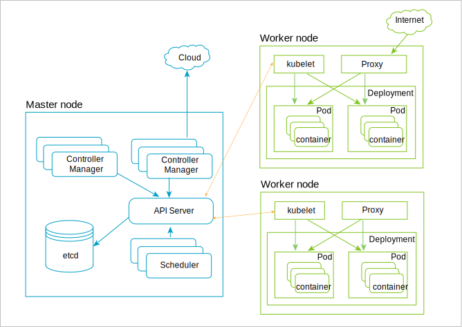

---

copyright:
  years: 2019, 2022
lastupdated: "2022-07-08"

subcollection: hlf-support

---

{:external: target="_blank" .external}
{:shortdesc: .shortdesc}
{:screen: .screen}
{:codeblock: .codeblock}
{:note: .note}
{:important: .important}
{:tip: .tip}
{:pre: .pre}

Documentation for this on-prem product has been moved from IBM Cloud to IBM Documentation at [https://www.ibm.com/docs/en/SSGWM34_1.0.0/reference/k8s.html](https://www.ibm.com/docs/en/SSGWM34_1.0.0/reference/k8s.html){: external}. Update your bookmarks.
{: important}

# Kubernetes
{: #k8s-overview}

IBM Support for Hyperledger Fabric allows you to provision blockchain components into your Kubernetes cluster. Kubernetes is an open-source system for automating deployment, scaling, and management of containerized applications.
{: shortdesc}

Kubernetes provides a container-centric management environment. It orchestrates computing, networking, and storage infrastructure on behalf of user workloads. This provides much of the simplicity of Platform as a Service (PaaS) with the flexibility of Infrastructure as a Service (IaaS), and enables portability across infrastructure providers.

The following diagram explains the architecture of Kubernetes. For more explanation about nodes, containers, and pod, see the [Key Kubernetes objects](#k8s-overview-key-obj) section below.

{: caption="Figure 1. Kubernetes architecture diagram" caption-side="bottom"}

## Key Kubernetes objects
{: #k8s-overview-key-obj}

- **Cluster**

    A set of machines, called nodes, that run containerized applications managed by Kubernetes. A cluster has several worker nodes and at least one master node.

- **Node**

    A node is a worker machine in Kubernetes. A node may be a VM or physical machine, depending on the cluster. Each node contains the services necessary to run pods and is managed by the master components. The services on a node include the container runtime, `kubelet` and `kube-proxy`. For more information, see the [Kubernetes Node section](https://kubernetes.io/docs/concepts/architecture/nodes/){: external} in the Kubernetes documentation.

- **Container**

    A lightweight and portable executable image that contains software and all of its dependencies. Containers decouple applications from underlying host infrastructure to make deployment easier in different cloud or OS environments, and for easier scaling.

- **Pod**

    The smallest and simplest Kubernetes object. A Pod represents a set of running containers on your cluster. A Pod is typically set up to run a single primary container. It can also run optional sidecar containers that add supplementary features like logging. Pods are commonly managed by a Deployment. For more information, see the [Kubernetes Pod section](https://kubernetes.io/docs/concepts/workloads/pods/pod/){: external} in the Kubernetes documentation.

