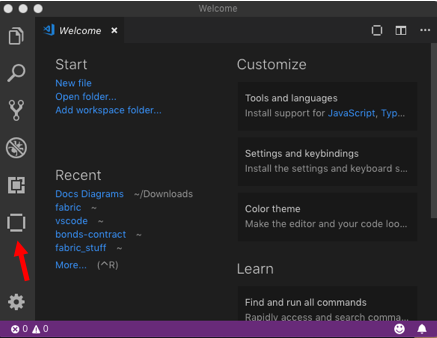

---

copyright:
  years: 2022
lastupdated: "2022-01-31"


keywords: vs code extension, Visual Studio Code extension, smart contract, development tools, multicloud

subcollection: hlf-support

---

{{site.data.keyword.attribute-definition-list}}


# Developing smart contracts with {{site.data.keyword.IBM_notm}} Blockchain Platform Developer Tools
{: #develop-vscode}

The {{site.data.keyword.IBM_notm}} Blockchain Platform Developer Tools provide an environment within Visual Studio (VS) Code for developing, packaging, and testing smart contracts. You can use the tools to create your smart contract project and get started developing your business logic. You can then use the tools to test your smart contract either on your local machine by using a preconfigured instance of Hyperledger Fabric, or by connecting to an {{site.data.keyword.IBM_notm}} Support for Hyperledger Fabric network, before you deploy the smart contract to the {{site.data.keyword.IBM_notm}} Support for Hyperledger Fabric network. This tutorial describes how to install and use the Developer Tools.

The {{site.data.keyword.IBM_notm}} Blockchain Platform VS Code extension works seamlessly with any instance of the {{site.data.keyword.IBM_notm}} Support for Hyperledger Fabric that uses Hyperledger Fabric version 2.2.3, or later. This tutorial is oriented toward users of the high-level Fabric smart contract programming model. If you are using low-level smart contract APIs, you can find additional instructions in the [{{site.data.keyword.IBM_notm}} Blockchain Platform VS Code extension documentation](https://github.com/IBM-Blockchain/blockchain-vscode-extension/blob/master/README.md). For more information, see the [Writing Your First Chaincode](https://hyperledger-fabric.readthedocs.io/en/release-2.2/chaincode4ade.html) tutorial in the Fabric documentation.
{: note}


## Install {{site.data.keyword.IBM_notm}} Blockchain Platform VS Code extension for free
{: #develop-vscode-install}

Before you install the {{site.data.keyword.IBM_notm}} Blockchain Platform VS Code extension on your local system, you must complete the prerequisites.

### Prerequisites
{: #develop-vscode-prerequisites}

- Windows 10, Linux, or Mac OS are currently the supported operating systems.
- VS Code [version 1.40 or greater](https://code.visualstudio.com/).
- [Docker version v17.06.2-ce or greater](https://www.docker.com/get-started){: external}.
- If you are developing Go smart contracts, you need to install [Go version v1.12 or greater](https://golang.org/dl/){: external}. Note that if you are using Fabric v2.x, you will need Go version v1.13 or higher instead.
- If you are developing Node smart contracts, you need to install [Node ^10.15.3 or ^12.15.0 and npm v6.x or greater](https://nodejs.org/en/download/){: external}.

Considerations if you are developing Java smart contracts:

- Java 11 is required to execute Java smart contracts.
- Gradle v4.x is used to build Java smart contracts.
- Custom Gradle versions can be used by using a Gradle wrapper.
- Java smart contracts must use fabric-chaincode-shim at v2.2.3 or later (if deploying on a peer that uses a Fabric 2.2.3 image; peers that use a Fabric 2.2.3 image do not require a shim), as this version is the first version that includes support for Java 11.
- For an example of a Java smart contract, see the [Basic asset transfer smart contract](https://github.com/hyperledger/fabric-samples/tree/master/asset-transfer-basic/chaincode-java){: external}.


If you are using Windows, you also must ensure the following:

- Docker for Windows is configured to use Linux containers (by default).
- You installed the C++ Build Tools for Windows from [windows-build-tools](https://github.com/felixrieseberg/windows-build-tools#windows-build-tools){: external}.
- You installed [OpenSSL v1.0.2](https://www.openssl.org/community/binaries.html){: external} if you are working with smart contracts that use Fabric v2.2.3 dependencies and want to run the generated functional tests.
    - Install the normal version, not the version marked as "light".
    - Install the Win64 version into C:\OpenSSL-Win64 on 64-bit systems.


**If you installed Node and npm by using a manager such as 'nvm' or 'nodenv', you need to set the default or global version. You can then restart VS Code for the version to be detected by the Prerequisites page.**

### Install the extension
{: #develop-vscode-installing-the-extension}

1. Ensure that you are running VS Code version 1.40 or greater.
2. Go to the [Visual Studio Code extension marketplace page](https://marketplace.visualstudio.com/items?itemName=IBMBlockchain.ibm-blockchain-platform){: external} or search for **{{site.data.keyword.IBM_notm}} Blockchain Platform** in the extensions panel within Visual Studio Code.
3. Click **Install**.
4. If you are upgrading the extension, you will need to restart VS Code to complete installation of the extension.  

After the installation, you can use the {{site.data.keyword.IBM_notm}} Blockchain Platform icon on the left side of VS Code to open the {{site.data.keyword.IBM_notm}} Blockchain Platform panel.

{: caption="Figure 3. {{site.data.keyword.IBM_notm}} Blockchain Platform icon in VS Code" caption-side="bottom"}

The extension also adds new commands to the Visual Studio Code command palette. You can use the command palette to complete many of the operations that are explained in details in this guide.

## Step one: Guided tutorials in VS Code
{: #develop-vscode-guided-tutorials}

The {{site.data.keyword.IBM_notm}} Blockchain Platform Developer Tools includes guided tutorials to help you get started. The tutorials provide step-by-step instructions on how to develop and test your smart contract project, as well has how to deploy the smart contract to a network on {{site.data.keyword.cloud_notm}}. You also can find sample smart contracts that are available for you to download.

To navigate to the tutorials from within VS Code, click the blockchain icon in the left navigation and then click the {{site.data.keyword.IBM_notm}} Blockchain Platform icon at the upper right corner to view the extension homepage. On the homepage, you can find a link to the tutorials gallery and the sample smart contracts.


## Step two: Create a smart contract project
{: #develop-vscode-creating-a-project}

You can use the extension to create a new smart contract project in Visual Studio Code. The extension creates a basic smart contract that manages an example asset in the language of your choice. You can use the structure of the example as a starting point for developing your own business logic. The extension provides all the dependencies that are required to deploy your smart contract to an instance of Hyperledger Fabric.

1. Click the **{{site.data.keyword.IBM_notm}} Blockchain Platform** icon to open the **{{site.data.keyword.IBM_notm}} Blockchain Platform** tab. Click the overflow menu in the smart contracts pane and click **Create New Project**.
2. Select the smart contract type to generate. The **Default Contract** example is recommended for first-time users and demonstrates how to perform create, read, update, and delete operations to the public ledger that's shared by all network members.
The **Private Data Contract** example demonstrates how to perform create, read, update, delete, and verify operations to a collection, that is private to a single network member.
3. Select the language that you want to create a smart contract in. The current options are JavaScript, TypeScript, Go, and Java. **Note:** If you are deploying the smart contracts to a production network, JavaScript and TypeScript smart contracts require more resources than contracts written in Go.
4. Select an asset to be managed by the example contract. For example, ***bond***.
5. Create a folder with the name of your project and open it.
6. Select how to open your new project. The project folder should now open.

When the project opens, you can find the new smart contract in the explorer window in the left pane. The structure of the project depends on the language that you selected. However, each smart contract contains the same elements:
- The source code of the smart contract. If you selected to create a JavaScript or TypeScript contract, the extension builds a basic smart contract by using the `fabric-contract-api` with a series of functions that manage your example asset. For example, if you selected ***bond***, you can find the functions of `createBond`, `updateBond`, `readBond`, `bondExists`, and `deleteBond`.
- A test file.
- The accompanying smart contract dependencies.

### Do I need to update my smart contract for Fabric v2.x?
{: #develop-vscode-creating-a-project-v2}

Although support for Fabric 2.x networks was added to the platform, you can still run your existing smart contracts on your peers that run a v1.4 image on a channel with an application capability level of 1.4 or lower. Should you later decide to upgrade your peer to a v2.x image and update your channel application capability level to 2.x, **you may need to update your existing smart contract**. However, after you upgrade your peer image to v2.x and channel application capability v2.x, there is no longer a way to update the original smart contract. Instead, when an update is required, you need to repackage the smart contract in the new `.tar.gz` or `.tgz` format using v2 of the VS Code extension and then propose the definition to the channel using the new smart contract lifecycle process.  

Review the following considerations:  

**Node**  

If your smart contract was written in Node, then you might need to update it. By default, a Fabric v1.4 peer will create a Node v8 runtime, and a Fabric v2.x peer creates a Node v12 runtime. In order for a smart contract to work with Node v12 runtime, the `fabric-contract-api` and `fabric-shim` node modules must be at v1.4.5 or greater. If you are using a smart contract that was originally written to work with Fabric 1.4, update the Node modules by running the following command before deploying the smart contract on a Fabric v2.x peer.  See [Support and compatibility for fabric-chaincode-node](https://github.com/hyperledger/fabric-chaincode-node/blob/main/COMPATIBILITY.md) for more information.
```
npm install --save fabric-contract-api@latest-1.4 fabric-shim@latest-1.4
```
{: codeblock}

**Go**  

Because Fabric v2.x peers do not have a "shim" (the external dependencies that allowed smart contracts to run on earlier versions of Fabric), you need to vendor the shim and then repackage any smart contracts written in Golang (Go) that use the [Go SDK](https://github.com/hyperledger/fabric-sdk-go). "Vendoring the shim"  effectively means that you are copying the dependencies into your project. Without this vendoring and repackaging, the Go smart contract cannot run on a peer using a Fabric 2.x image. If you are using the [IBM Developer Tools](/docs/hlf-support?topic=hlf-support-develop-vscode) to develop and package your smart contract, the tooling performs the vendoring for you. This process is not required for smart contracts that are written in Java or Node.js, nor for Go smart contracts that use the [Go contract-api](https://github.com/hyperledger/fabric-contract-api-go){: external}.

**Java**  
The `build.gradle` file for the smart contract must be updated:

1. If the smart contract uses the `shadowjar` 2.x plugin, then it should be updated to version 5 by using the following code:
    ```
    plugins {
        id 'com.github.johnrengelman.shadow' version '5.1.0'
        id 'java'
    }
    ```
    {: codeblock}

2. The `repositories` section of the file must contain the `maven URL` for `jitpack`, for example:
    ```
        repositories {
        ...
        maven {
            url 'https://jitpack.io'
        }
    }
    ```
    {: codeblock}


**Init functions**  

If the smart contract was written using the **low-level APIs** provided by the Fabric Chaincode Shim API, your smart contract needs to contain an `Init` function that is used to initialize the chaincode.  This function is required by the smart contract interface, but does not necessarily need to be invoked by your applications. Because you cannot use the console to deploy a smart contract that contains an `Init` function, you need to move that initialization logic into the smart contract itself and call it separately. For example, the smart contract can use a reserved key to check whether the smart contract has already been initialized or not. If not, then call the initialization logic, otherwise proceed as usual. If your smart contract needs to include the `Init` function, the only way to deploy it is by using the Fabric [peer lifecycle chaincode install](https://hyperledger-fabric.readthedocs.io/en/release-2.2/commands/peerlifecycle.html#peer-lifecycle-chaincode-install){: external} command or the [{{site.data.keyword.IBM_notm}} Blockchain Platform collection for Ansible](https://ibm-blockchain.github.io/ansible-collection/){: external}. You can also refer to the [Fabric documentation](https://hyperledger-fabric.readthedocs.io/en/release-2.2/chaincode_lifecycle.html#step-three-approve-a-chaincode-definition-for-your-organization){: external} for more details on how to use an `Init` function with the Fabric chaincode lifecycle.

**Repackage smart contract**  

After you have updated your smart contract, use [v2](/docs/hlf-support?topic=hlf-support-develop-vscode#develop-vscode-installing-the-extension) of the VS Code extension to [repackage](/docs/hlf-support?topic=hlf-support-develop-vscode#packaging-a-smart-contract) your smart contract.   

## Step three: Package a smart contract
{: #packaging-a-smart-contract}

You need to package a smart contract before you can install it on your {{site.data.keyword.IBM_notm}} Support for Hyperledger Fabric network or the preconfigured Hyperledger Fabric network. **Fabric V1 channels require smart contract packages to be in the `.cds` format, and V2 require the `.tar.gz` format.** Complete the following steps to package your smart contract:

1. Open your smart contract project in VS Code by clicking **File** and then click **Open ...**. Ensure that you have the smart contract project open in the file viewer.
2. Click the **{{site.data.keyword.IBM_notm}} Blockchain Platform** icon to open the **{{site.data.keyword.IBM_notm}} Blockchain Platform** tab.
3. In the **Smart Contracts** pane, click the overflow menu and select **Package Open Project**. You are asked for the name of the package and the version. You will also need to select whether you want to package it as a `.tar.gz` (for deploying to a channel with V2 application capability) or `.cds` (for deploying to a channel with V1 application capability). To find out the channel capabibilities/version, hover your mouse over the channel in the **Fabric Environments** panel that you wish to deploy to. This will display a tooltip containing the channel capabilities.
    - If you have one smart contract project, it is packaged automatically and be displayed in the **Smart Contracts** pane.
    - If you have multiple smart contract folders open, you are asked which one to package.
    - If you have no smart contract folders open, you get an error message.

If you want to control which files in the project are packaged, you can create a `.fabricignore` file in the top-level directory of your smart contract project. The file and pattern format for a `.fabricignore` file is the same as a [`.gitignore`](https://git-scm.com/docs/gitignore) file, for example:

```
/.classpath
/.git/
/.gradle/
/.project
/.settings/
/bin/
/build/
```


### Exporting, importing, and deleting a smart contract package
{: #develop-vscode-exporting-deleting-smart-contract-package}

After you package a smart contract project, you can export it from VS Code:

1. In the {{site.data.keyword.IBM_notm}} Blockchain Platform extension panel, right-click the smart contract package and select **Export Package**.
2. Choose the directory to save your smart contract package file and click **Export**.

You can also import an existing smart contract package into the {{site.data.keyword.IBM_notm}} Blockchain Platform pane:

1. In the **Smart Contracts** pane, click the overflow menu and select **Import a Package**.
2. Browse to the smart contract package that you want to import, and click **Import**.

You can also click **Delete Package** to remove the smart contract package from the list of packages.

## Step four: Deploy a smart contract to a preconfigured Hyperledger Fabric network
{: #develop-vscode-deploy}

You can use the VS Code extension to deploy your smart contract to a preconfigured Hyperledger Fabric network that the extension creates on your local machine. If you are deploying to a V1 capability enabled channel, you need to install and instantiate your smart contract. If you are deploying to a V2 capability enabled channel that uses the new Fabric 2.x lifecycle process, you need to install then "approve" and "commit" a smart contract, as opposed to instantiating it.

### Deploying a preconfigured Hyperledger Fabric network
{: #develop-vscode-connecting-and-disconnecting}

Before you can deploy a smart contract, use the following steps to deploy the preconfigured network:

1. Ensure that Docker is running on your machine.
2. Open the **{{site.data.keyword.IBM_notm}} Blockchain Platform** tab in VS Code.
3. In the **Fabric Environments** pane, click **1 Org Local Fabric**. If Docker is running, the local instance should be started once the Hyperledger Fabric images are downloaded.
4. Click **1 Org Local Fabric - Org1 Gateway** in the **Fabric Gateways** pane to connect to the local network.

The VS Code extension creates a basic Fabric network that includes one orderer, one peer, and one certificate authority. The peer is joined to a channel named `mychannel`. You can find the list of nodes, organizations, and channels that belong to the network in the **Fabric Environments** pane. Above these nodes, you can find the list of smart contracts that are deployed on your channels.

Use the following steps to create a new one organization or two organization network:

1. Ensure that Docker is running on your machine.
2. Hover your mouse over the **Fabric Environments** pane and click **+**, **Add Environment**.
3. Select **Create new from template**.
4. Select **1 Org template (1 CA, 1 peer, 1 channel)**. Alternatively, if you want a larger network or have generated a **Private Data Contract** then select **2 Org template (2 CAs, 2 peers, 1 channel)**.
5. Select **V2_0** when asked to choose the channel capability version to use for the network. Alternatively, if you wish to have v1 channel capabilities select the other option.

This will then take a few minutes to create a local Fabric network including the environment, gateways, and wallets.

#### Stopping, restarting, tearing down and deleting a preconfigured network
{: #develop-vscode-stop-Fabric-runtime}

You can stop or restart the preconfigured network while it is running:

1. In the **Fabric Environments** pane, click the overflow menu.
2. Select **Restart**, **Stop**, **Teardown** to stop, restart, or teardown the container.

Selecting **Teardown** will completely remove the local Fabric network. **Note:** This removal results in the loss of the ledger and world state data.

Selecting **Delete** will perform a **Teardown** as well as remove the network from the **Fabric Environments** pane.

### Deploying your smart contract (channel application capability V2)
{: #develop-vscode-deploy-smart-contract-v2}

Smart contracts can be deployed by using the **deploy view**. This view handles all the deployment steps (install, approve, commit) which are required by the smart contract lifecycle on channels that are enabled with application capability v2.0 or higher.

Follow these steps if you have your channel is configured with application capability V2 or higher and a `.tar.gz` smart contract package.

To launch the deploy view:

1. Check that you are connected to the network in the **Fabric Environments** pane.
2. Expand the channel that you want to deploy your smart contract to.
2. Click **+ Deploy smart contract**.

There are three steps to deploying a smart contract by using the deploy view.

#### Step 1: Choose a smart contract to deploy
{: #develop-vscode-deploy-smart-contract-v2-choose}

1. Use the dropdown to select the smart contract package that you want to deploy.
2. Click **Next** to proceed.

#### Step 2: Create definition
{: #develop-vscode-deploy-smart-contract-v2-createdef}

1. Provide a name and a version for the smart contract in the appropriate input fields. By default these parameters will be filled by the name and version of the package.
2. (Optional) Enter a custom [endorsement policy](#x8911635){: term} in the appropriate input field.
3. (Optional) Select **Add file** to browse to your collection configuration file if your smart contract uses private data, such as the **Private Data Contract** example.
4. Click **Next** to proceed.

#### Step 3: Deploy
{: #develop-vscode-deploy-smart-contract-v2-deploy}

1. Click **Deploy** to automatically install, approve, and commit the smart contract on all of the networks peers.
2. (Optional) Use the **Perform commit** toggle to enable or disable committing this smart contract definition to the channel.
3. (Optional) Click **Additional peers to endorse commit transactions** to select or deselect any available additional peers that you need to approve this smart contract definition.

**At this point, you smart contract is now "committed" on the channel.** If you have changed your smart contract code and then repackaged it, you can use the deploy view and follow the same steps as above to upgrade the smart contract definition that you have deployed to the network.

### Deploying your smart contract (channel application capability V1)
{: #develop-vscode-deploy-smart-contract}

Follow these steps if you have a channel that is configured with the application capability v1.x and a smart contract package that is in `.cds` format.

To launch the deploy view:

1. Check that you are connected to the network in the **Fabric Environments** pane.
2. Expand the channel that you want to deploy your smart contract to.
2. Click **+ Deploy smart contract**.

There are three steps to deploying a smart contract using the deploy view.

#### Step 1: Choose a smart contract to deploy

1. Use the dropdown to select the smart contract package that you want to deploy.
2. Click **Next** to proceed.

#### Step 2: Configure smart contract deployment

1. (Optional) Enter a custom [endorsement policy](#x8911635){: term} in the appropriate input field.
2. (Optional) Select **Add file** to browse to your collection configuration file if your smart contract uses private data, such as the **Private Data Contract** example.
3. Click **Next** to proceed.

#### Step 3: Deploy

1. Click **Deploy** to automatically install and instantiate (or upgrade) the smart contract on all of the networks peers.
2. (Optional) Enter the function name to call on instantiation/upgrade.
3. (Optional) Enter the function arguments to call on instantiation/upgrade.

**At this point, you smart contract is now instantiated on the channel.** If you have changed your smart contract code and then repackaged it, you can use the deploy view and follow the same steps as above to upgrade the smart contract that you have deployed to the network.

### Interacting with your smart contract
{: #develop-vscode-submitting-transactions}

After a smart contract is deployed to a channel, you can submit transactions to the functions inside your smart contract by using the **Fabric Gateways** pane:

1. Ensure that your smart contract is deployed to a channel, and that you are connected to the network.
2. In the **Fabric Gateways** pane, expand the **Channels** dropdown. Click the channel that the smart contract is instantiated or committed on.
3. Expand the smart contract that you want to interact with. You can find the list of transactions that are listed beneath your smart contract.
4. Right-click the transaction to submit, and select **Submit Transaction**. For example, if you created and packaged the example bonds smart contract, click **createBond**.
5. Enter any arguments that the transaction requires, and press **Enter**. For example, enter `["bond01","100"]` to create your first bond.
6. (Optional) Enter any arguments that will be submitted as transient data. Transient data is not stored on the channel ledger in order to keep the data private.

### Connecting your applications to the preconfigured network
{: #develop-vscode-exploring-connection-details}

You can test your client applications by connecting them to the preconfigured network and submitting transactions to your smart contract.

First, you need to export your connection profile:

1. Ensure that the network is running in the **Fabric Environments** pane.
2. Right-click on the gateway in the **Fabric Gateways** panel and select **Export Connection Profile**.

You can then use the Fabric SDKs and the connection profile to enroll your admin identity by using the username `admin` and the password `adminpw`. You can then use this identity to invoke your smart contract or register and enroll additional users.

## Step five: Test a deployed smart contract
{: #develop-vscode-testing-instantiated-smart-contract}

You can generate tests for smart contracts that are instantiated or committed on the channels that you connect to. The tests can be generated as either **JavaScript** or **TypeScript** for Node projects, **Java** for Java projects, or **Go** for Go projects. Generated tests can then be run or debugged.

1. Ensure that the smart contract is instantiated or committed on the channel.
2. In the **Fabric Gateways** pane, right-click the smart contract under the list of channels to generate tests for.
3. Select **Generate Smart Contract Tests**.
4. Select the language for the test file, either **JavaScript**, **TypeScript**, **Java**, or **Go**, depending on the smart contract language. The {{site.data.keyword.IBM_notm}} Blockchain Platform extension installs the required dependencies and builds the test file.
5. Make sure you have either the [Node Test Runner extension](https://marketplace.visualstudio.com/items?itemName=oshri6688.javascript-test-runner), [Java Test Runner extension](https://marketplace.visualstudio.com/items?itemName=vscjava.vscode-java-test) or [Go extension](https://marketplace.visualstudio.com/items?itemName=golang.Go) installed.

After the test file is built, the tests can be run by clicking the **Run Tests** button in the file.

## Step six: Connect to your {{site.data.keyword.IBM_notm}} Support for Hyperledger Fabric network
{: #develop-vscode-connecting-ibm-hlfsupport}

You can also use the extension to interact with your network on {{site.data.keyword.IBM_notm}} Support for Hyperledger Fabric.

### Invoke a smart contract that has been instantiated or committed on your channels
{: #develop-vscode-connecting-ibm-hlfsupport-invoke}

You can download your connection profile from the Fabric Operations Console to build a gateway in the **Fabric Gateways** pane. You can then use the gateway to invoke the smart contracts that were deployed on your channel.

Open the Fabric Operations Console that is associated with your instance of  {{site.data.keyword.IBM_notm}} Support for Hyperledger Fabric. Navigate to the **Organizations** tab and click the **Organization MSP** tile for the organization that your client application will interact with. Click **Create connection profile** to open a side panel that allows you to [build and download your connection profile](/docs/hlf-support?topic=hlf-support-ibm-hlfsupport-console-app#ibm-hlfsupport-console-app-profile) to your local file system. Then, [create an application identity](/docs/hlf-support?topic=hlf-support-ibm-hlfsupport-console-app#ibm-hlfsupport-console-app-identities) by using your CA and save the enrollID and secret.

Use the following steps to connect to {{site.data.keyword.IBM_notm}} Support for Hyperledger Fabric from VS Code:

1. Open the **{{site.data.keyword.IBM_notm}} Blockchain Platform** tab.
2. Hover your mouse over the **Fabric Gateways** pane and click **+**.
3. Choose **Create a gateway from a connection profile**.
4. Enter a name for the connection.
5. Enter the fully qualified file path of your connection profile. Your connection should now appear in the connections list underneath **1 Org Local Fabric**.
6. Hover your mouse over the **Fabric Wallets** pane and click **+**.
7. Choose **Create a new wallet and add an identity** from the options. Provide a name for your wallet and your identity.
8. Enter the MSP ID of your organization.
9. Click **Select a gateway and provide an enrollment ID and secret** option and choose the gateway that you created above.
10. Enter the enrollID and secret of the application identity that you created with the console. A new identity is created in the **Fabric Wallets** pane.
11. You can now connect to your instance of {{site.data.keyword.IBM_notm}} Support for Hyperledger Fabric. Click the connection name and select the name of the wallet that you created. You can also associate the wallet that you created with the gateway by right-clicking the gateway and selecting **Associate A Wallet**. This allows the connection to use the same wallet each time when it connects.

After you connect to {{site.data.keyword.IBM_notm}} Support for Hyperledger Fabric from VS Code, you can see the list of channels joined by your organization peers under the gateway. Under each channel, you can see the list of smart contracts that are instantiated or committed on each channel and the transactions within each smart contract. You can submit transactions to your network by right-clicking a function and selecting **Submit Transaction** and passing the required arguments. You can also generate a test file for the smart contracts that are instantiated on your channels.


### Deploy a smart contract from VS Code
{: #develop-vscode-connecting-ibm-hlfsupport-install-instantiate}


You can also import the {{site.data.keyword.IBM_notm}} Support for Hyperledger Fabric network into the **Fabric Environments** pane of the extension. You can then use the VS Code extension to deploy smart contracts on your network.

You can export nodes from your console and then import them from another console. You can use the same process to export nodes from your console and then import them into the **Fabric Environments** pane. The easiest way is to use the extension to automatically discover the console and import the nodes.

1. Navigate to the **Settings** tab in the left navigation. You can see a section that is called **Bulk data management** that contains two buttons. The **Export** button opens a panel on the right.  
2. Check the box to export your identities. You can deselect the other options.
3. Click **Export** to download the identities to your local file system in .zip file. Extract the file when the download is complete.

You can then import the nodes of your network into the extension.

#### Importing Kubernetes cluster nodes
{: #develop-vscode-connecting-ibm-hlfsupport-k8s}

Import your Kubernetes cluster nodes into the extension:

1. Hover your mouse over the **Fabric Environments** pane and click **+**, **Add Environment**.
2. Select **Add an {{site.data.keyword.IBM_notm}} Blockchain Platform network**.
3. Select **No** when asked whether to connect to an {{site.data.keyword.IBM_notm}} Blockchain Plaatform service instance on {{site.data.keyword.cloud_notm}}.
4. Enter the URL of the {{site.data.keyword.IBM_notm}} Blockchain Platform console software instance.
5. Enter the **User ID** for the console instance.
6. Enter the **Password** for the console instance.
7. Select **Proceed without certificate verification**, or **Cancel** if you're planning to add the CA certificates to the operating systems trusted CA certificate store.
8. Enter a name for your environment.
9. Select the CAs and peers that belong to your organization, along with the ordering nodes of your channels, click **OK** when done.

In steps 5 and 6, you can alternatively enter an API key and secret that you generate using the [{{site.data.keyword.IBM_notm}} Support for Hyperledger Fabric REST APIs](/docs/hlf-support?topic=hlf-support-ibm-hlfsupport-v2-apis#console-icp-manage-create-api-key).
{: tip}

You also need to import your admin identities into the wallet pane and associate them with your nodes. You need to associate an admin identity with your peers, CA, and an ordering node before you can connect with your network.

1. Click on the environment that you created in the **Fabric Environments** pane.
2. You can see an **Alert** sign next to the peer and ordering node. Click on the alert to associate an admin identity with the node.
3. Select **Add a new wallet**.
4. Select **Create a new wallet**.
5. Enter a name for your wallet to identify the orderer or peer admin of your network.
6. Select **Add a new identity**.
7. Enter name for your peer or orderer admin identity.
8. Select **Provide a JSON identity file from {{site.data.keyword.IBM_notm}} Blockchain Platform** and then browse to the admin identity that you exported from your console. If the identity is the administrator of multiple nodes in your network, you can associate the identity with multiple nodes.

When you have associated an admin identity with your peers, CA, and an ordering node, you can connect to your network and use the extension to deploy smart contracts.

### Adding wallets and users
{: #develop-vscode-add-a-wallet}

Use the following steps to create a new wallet by using a certificate and private key:

1. Hover your mouse over the **Fabric Wallets** pane and click **+**.
2. Choose to **Create a new wallet and add an identity** from the options. Provide a name for your wallet and your identity.
3. Enter the MSP ID of your organization.
4. Choose to add a certificate and private key.
5. If you use a certificate and private key, browse to the certificate and private key.

You can also add new users to the wallets that have already been created:

1. In the **Fabric Wallets** pane, right-click a wallet and select **Add Identity**.
2. Provide a name for the identity and an MSP ID.
3. You can upload a JSON file, provide a certificate and private key, or provide an enrollment ID and secret.
    - If you are connecting to a network on {{site.data.keyword.IBM_notm}} Support for Hyperledger Fabric, you can download an identity from your Fabric Operations Console, either by exporting an identity from your wallet or by enrolling and then exporting an identity using your Certificate Authority. You can then upload the JSON file directly to VS Code.
    - If you use a certificate and private key, browse to the certificate and private key.
    - If you use an enrollment ID and secret, choose the gateway to enroll with and enter the enrollment ID and secret.
